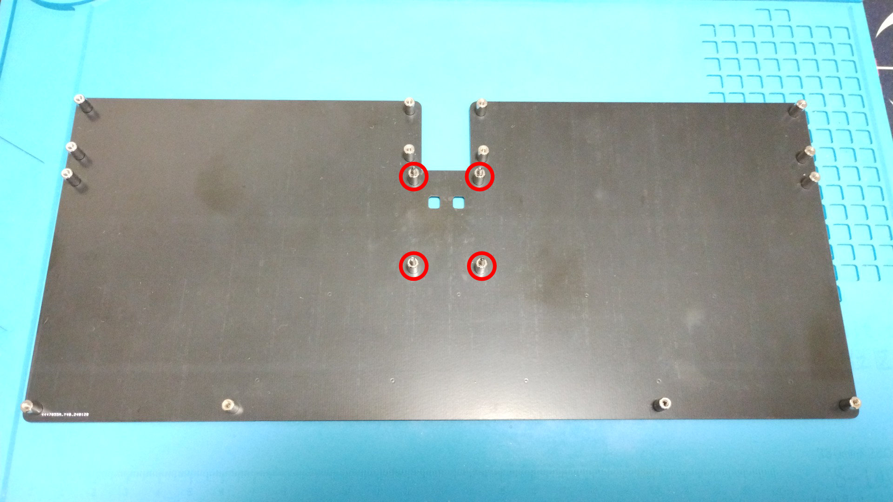
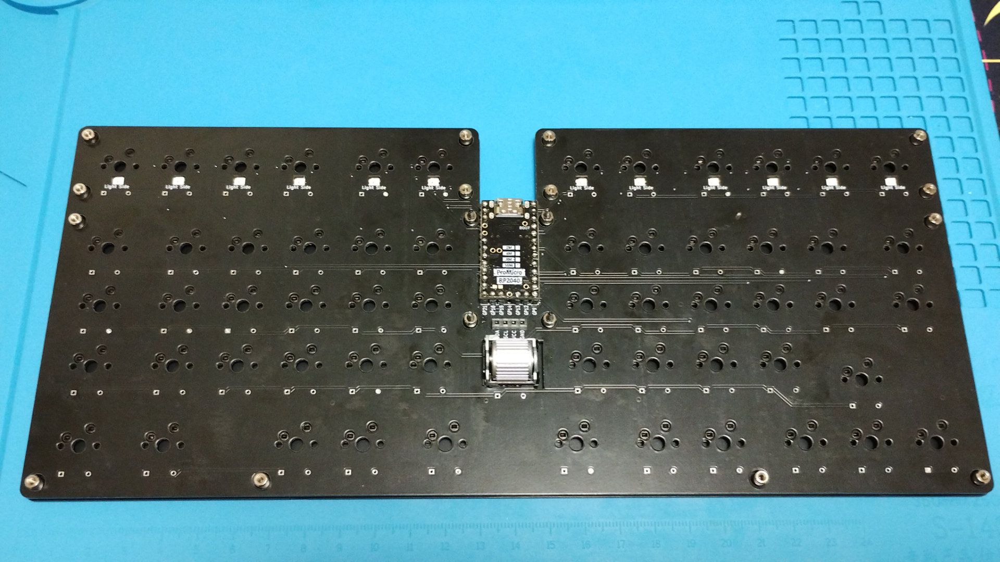
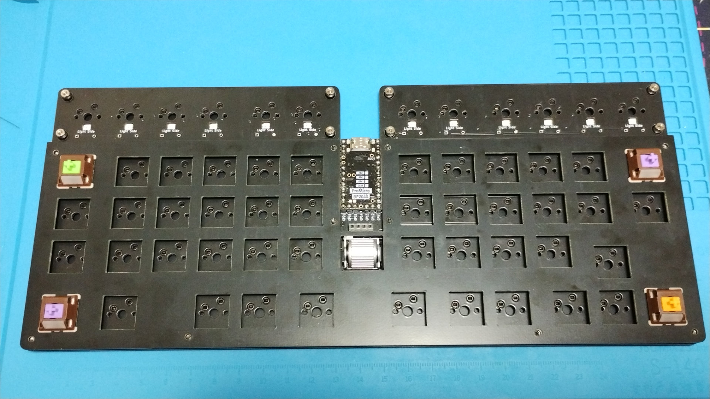
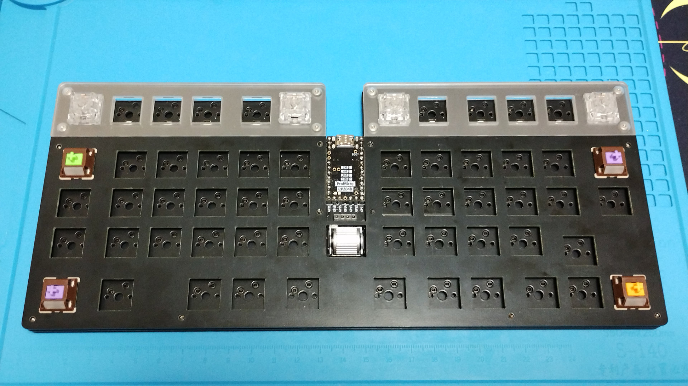
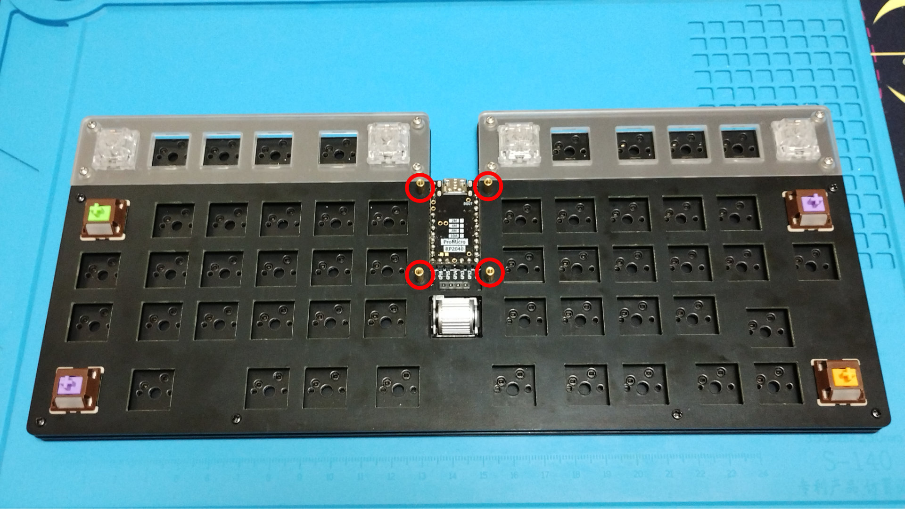
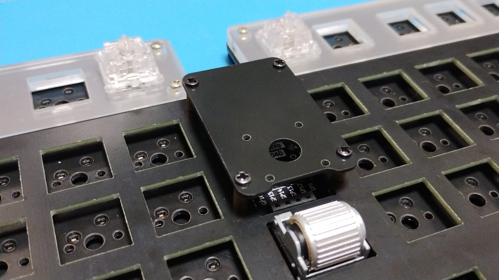
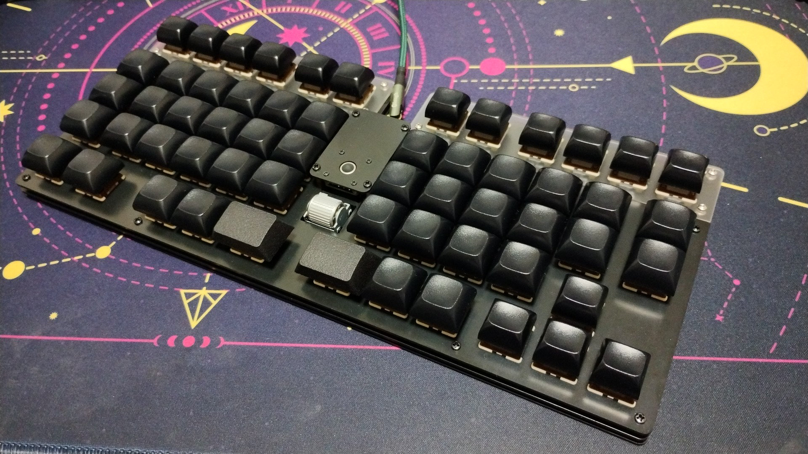

# Build guide

## Parts
Name                     |Quantity |Notes
-------------------------|---------|-----
PCB                      |1        |
Switch plate A           |1        |
Switch plate B_Left      |1        |
Switch plate B_Right     |1        |
Bottom plate             |1        |
Cover plate              |1        |
SK6812 MINI-E leds       |12       |
1N4148W diodes           |58       |
Kailh hotswap sockets    |58       |
ProMicro RP2040          |1        |[Aliexpress](https://www.aliexpress.com/item/1005006355650714.html)
M2x4mm screws            |32       |
M2x12mm screws           |4        |
M2x7mm spacer         |18       |
M2x7mm Knurled spacer |4        |[Aliexpress](https://www.aliexpress.com/item/1005002979083511.html)

### Optionally
Name |Quantity |Notes
-----|---------|-----
20P Low profile pinsocket |2    |Used to socket the ProMicro RP2040. [AKIZUKI DENSHI](https://akizukidenshi.com/catalog/g/g103138/)
EVQWGD001 rotary encoder  |1    |[Aliexpress](https://www.aliexpress.com/item/32990950196.html), [TALPKEYBOARD](https://talpkeyboard.net/items/65cdb71207d2c4002b622ce0), [Yushakobo](https://shop.yushakobo.jp/products/3971)
AZ1UBALL                  |1    |Only one of this or StickPointV can be attached. [Booth](https://booth.pm/ja/items/4202085)
StickPointV               |1    |Only one of this or AZ1UBALL can be attached. Also, use those without glove socket mounts. [Booth](https://booth.pm/ja/items/5404009)
FSS-41035-04 4P pinsocket |1    |Used when AZ1UBALL or StickPointV is installed. [HIROSUGI NET](https://www.hirosugi-net.co.jp/shop/goods/goods.aspx?goods=24081), [Yushakobo](https://shop.yushakobo.jp/products/a1600ps-01-1)
PSS-410153-04 4P pinheader |1    |Used when AZ1UBALL or StickPointV is installed. [HIROSUGI NET](https://www.hirosugi-net.co.jp/shop/g/g21243/), [Yushakobo](https://shop.yushakobo.jp/products/a1600ph-01-1)
M2x6mm Knurled spacer |4        |Used when StickPointV is installed. [Aliexpress](https://www.aliexpress.com/item/1005002979083511.html)
M2x10mm Knurled spacer |4        |Used when StickPointV is installed. [Aliexpress](https://www.aliexpress.com/item/1005002979083511.html)

## Building

### [Leds](https://github.com/is-watering/isw-kbd-building-tips/blob/main/doc/soldering-led.md)

### [Diodes](https://github.com/is-watering/isw-kbd-building-tips/blob/main/doc/soldering-diode.md)

### [Hotswap sockets](https://github.com/is-watering/isw-kbd-building-tips/blob/main/doc/soldering-hotswap-socket.md)

### ProMicro RP2040 (with socket)

### ProMicro RP2040 (without socket)

## Case
Use a 4mm screw to secure the 7mm spacer. However, use a 12mm screw to secure the red marked areas.

Place the PCB on the bottom plate.

Place switch plate A on the PCB. It is easier to align the key switches if they are attached to the four corners.

Place switch plate B on the PCB. It is easier to align the key switches if they are attached to both ends.

Use a 4mm screw to secure the switch plate.Fix the switch plate using a 4mm screw.Also,
Also, attach the 7mm Knurled spacer at the point marked in red.

Fix the cover plate with a 4mm screw.

Attach a key switch and key cap of your choice to complete the process!

Congratulations on the completion! Please be proud of it on social networking sites! `#isw_oozy`